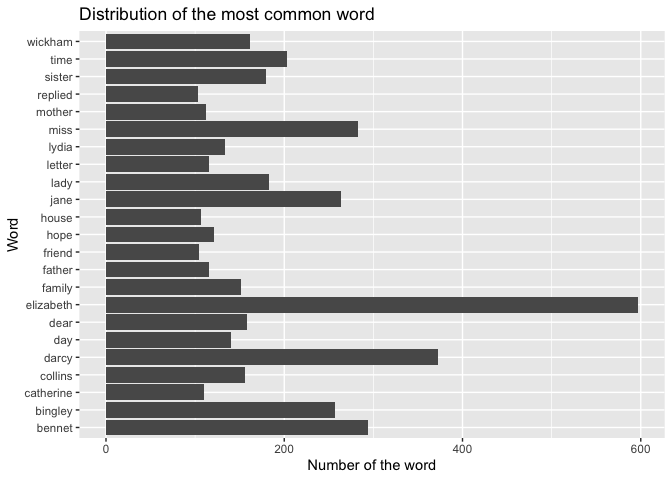

Assignment B-4 Option A: Strings and/or Functional Programming
================

1.  Install the required package

<!-- -->

    install.packages("palmerpenguins")
    install.packages("tidytext")
    install.packages("ggwordcloud")

1.  Load the packages below.

``` r
library(janeaustenr)
library(tidytext)
library(tidyverse)
```

    ## ── Attaching packages ─────────────────────────────────────── tidyverse 1.3.2 ──
    ## ✔ ggplot2 3.3.6      ✔ purrr   0.3.4 
    ## ✔ tibble  3.1.8      ✔ dplyr   1.0.10
    ## ✔ tidyr   1.2.1      ✔ stringr 1.4.1 
    ## ✔ readr   2.1.2      ✔ forcats 0.5.2 
    ## ── Conflicts ────────────────────────────────────────── tidyverse_conflicts() ──
    ## ✖ dplyr::filter() masks stats::filter()
    ## ✖ dplyr::lag()    masks stats::lag()

``` r
library(ggwordcloud)
library(testthat)
```

    ## 
    ## Attaching package: 'testthat'
    ## 
    ## The following object is masked from 'package:dplyr':
    ## 
    ##     matches
    ## 
    ## The following object is masked from 'package:purrr':
    ## 
    ##     is_null
    ## 
    ## The following objects are masked from 'package:readr':
    ## 
    ##     edition_get, local_edition
    ## 
    ## The following object is masked from 'package:tidyr':
    ## 
    ##     matches

2.  Exercise 1: Remove “stop words” and make a plot of the most common
    words in the book (Pride & Prejudice from janeaustenr).

# To understand the structure of the austen_books

``` r
# use the austen_books() from the janeaustenr package
print(austen_books()) # print the header and first 10 rows of austen_books() 
```

    ## # A tibble: 73,422 × 2
    ##    text                    book               
    ##  * <chr>                   <fct>              
    ##  1 "SENSE AND SENSIBILITY" Sense & Sensibility
    ##  2 ""                      Sense & Sensibility
    ##  3 "by Jane Austen"        Sense & Sensibility
    ##  4 ""                      Sense & Sensibility
    ##  5 "(1811)"                Sense & Sensibility
    ##  6 ""                      Sense & Sensibility
    ##  7 ""                      Sense & Sensibility
    ##  8 ""                      Sense & Sensibility
    ##  9 ""                      Sense & Sensibility
    ## 10 "CHAPTER 1"             Sense & Sensibility
    ## # … with 73,412 more rows

# Set up the data as we needed

``` r
words_in_prideprejudice <- austen_books() %>%
  unnest_tokens(word, text) %>% # split text into tokens(words)
  filter(book == "Pride & Prejudice") %>% # select the book Pride & Prejudice
  count(word, sort = TRUE) %>% # count the number of each word in the book Pride & Prejudice
  anti_join(stop_words, by = "word") # remove stop words
words_in_prideprejudice
```

    ## # A tibble: 6,009 × 2
    ##    word          n
    ##    <chr>     <int>
    ##  1 elizabeth   597
    ##  2 darcy       373
    ##  3 bennet      294
    ##  4 miss        283
    ##  5 jane        264
    ##  6 bingley     257
    ##  7 time        203
    ##  8 lady        183
    ##  9 sister      180
    ## 10 wickham     162
    ## # … with 5,999 more rows

# Get the most common words for bar plot

``` r
common_words_for_bar <- words_in_prideprejudice %>%
  # I choose less common words for bar plot, otherwise the plot will be messy
  filter(n > 100) # get the words whose number exceeds 100
common_words_for_bar
```

    ## # A tibble: 23 × 2
    ##    word          n
    ##    <chr>     <int>
    ##  1 elizabeth   597
    ##  2 darcy       373
    ##  3 bennet      294
    ##  4 miss        283
    ##  5 jane        264
    ##  6 bingley     257
    ##  7 time        203
    ##  8 lady        183
    ##  9 sister      180
    ## 10 wickham     162
    ## # … with 13 more rows

# Draw a bar plot for the most common words in Pride & Prejudice

``` r
common_word_plot <- ggplot(common_words_for_bar, aes(x = word, y = n)) + # ggplot where x = word, y = n
  geom_bar(stat="identity") + # draw bar plot 
  labs(x = "Word", y = "Number of the word", title = "Distribution of the most common word")
common_word_plot + coord_flip()
```

<!-- -->

``` r
common_words_for_cloud <- words_in_prideprejudice %>%
  filter(n > 50) # get the words whose number exceeds 100
common_words_for_cloud
```

    ## # A tibble: 93 × 2
    ##    word          n
    ##    <chr>     <int>
    ##  1 elizabeth   597
    ##  2 darcy       373
    ##  3 bennet      294
    ##  4 miss        283
    ##  5 jane        264
    ##  6 bingley     257
    ##  7 time        203
    ##  8 lady        183
    ##  9 sister      180
    ## 10 wickham     162
    ## # … with 83 more rows

# Draw a word cloud for the most common words in Pride & Prejudice

``` r
# The larger the font, the more frequently the word occurs
ggplot(common_words_for_cloud, aes(label = word, size = n, 
                                   color = factor(sample.int(20, nrow(common_words_for_cloud), replace = TRUE)))) +
  geom_text_wordcloud(shape = "circle") + # word cloud will be in circle shape
  scale_size_area(max_size = 10) + # scale size of words and set max size to be 10
  theme_minimal() 
```

<!-- -->

3.  Exercise 2: Make a function that converts words to my own version of
    Pig Latin.

``` r
#' Convert Words to My Pig Latin Version
#'
#' The function can convert words to my version of Pig Latin
#' For words that end with consonant sounds, all letters after the last vowel are placed at the beginning of the word sequence.
#' When words end with consonant clusters (multiple consonants that form one sound), the whole sound is added to the beginning.
#' For words end with vowel sounds, one moves the last vowel along with the consonant clusters to the beginning. 
#' If the penultimate character is also a vowel, only the last vowel is moved.
#' Add “wow” to the end of the word
#'
#' @param words - An English string that you want to transfer to the Pig Latin version 
#' 
#' @return A string that in my Pig Latin version (all words will be in the lowercase)
#' 
#' @examples
#' pig_latin("Example")
#' pig_latin("Chenru Zhao")
#' pig_latin("this is a example")

pig_latin <- function(words) {
  # the input should be a string
  if(!assertthat::is.string(words)) {
    stop("The input should be a string.")
  }
  
  # the input should not be empty
  if(words == "") {
    stop("The input is empty.")
  }
  
  vowel_sounds <- c("a", "e", "i", "o", "u") # store vowel sounds 'a, e, i, o, u' in a vector
  # a function help to determine if a char is vowel
  is_vowel_sound <- function(char) {
    char %in% c(vowel_sounds, toupper(vowel_sounds))
  }
  
  # a function help to determine the index of the last vowel in the word
  get_last_vowel_index <- function(word) {
    char_list <- stringr::str_split(word, "")[[1]] # split the word to chars
    purrr::detect_index(char_list, is_vowel_sound, .dir = "backward") # find the index of the last vowel in the word
  }
  
  words_list <- strsplit(words, "\\s+") # split the input string to words
  pig_latin_result <- "" # help to store the pig latin result
  # traverse each word in the input string 
  for(word in words_list[[1]]) {
    word <- tolower(word) # make all chars in lowercase
    word_count <- nchar(word) # count how many chars in a word
    last_vowel_index <- get_last_vowel_index(word) # get the last vowel index of the word
    # if the last character of a word is vowel and it contains more than one char
    if(last_vowel_index == word_count && last_vowel_index != 1) {
      # move the last vowel char to the beginning and update the word
      word <- paste((str_sub(word, word_count, word_count)), (str_sub(word, 1, word_count-1)), sep = "")
      # find the consonant clusters before the last vowel char of the original word
      last_vowel_index <- get_last_vowel_index(word)
    }
    # move consonant (clusters) after the last vowel index to the beginning
    pig_latin_word <- paste((str_sub(word, last_vowel_index+1)), (str_sub(word, 1, last_vowel_index)), "wow", sep = "")
    if(pig_latin_result == "") {
      # if the result is empty paste word into result without space
      pig_latin_result <- paste(pig_latin_result, pig_latin_word, sep = "")
    } else {
      # if the result is not empty paste word into result with space
      pig_latin_result <- paste(pig_latin_result, pig_latin_word)
    }
  }
  
  # return the result
  return(pig_latin_result)
}
```

# Examples of my pig_latin function

``` r
# we will not see y as vowel in my Pig Latin version.
# since there is no vowel in the word 'cry', move the consonant clusters to the beginning will cause no change
result1 <- pig_latin("cry")
print(result1)
```

    ## [1] "crywow"

``` r
# end with vowel
# moves the last vowel along with the consonant clusters to the beginning for 'Chenru'
# the penultimate character is also a vowel, only the last vowel is moved for 'Zhao'
result2 <- pig_latin("Chenru Zhao")
print(result2)
```

    ## [1] "nruchewow ozhawow"

``` r
# a long example
result3 <- pig_latin("This is a example")
print(result3)
```

    ## [1] "sthiwow siwow awow mpleexawow"

# Test of my pig_latin function

``` r
test_that("pig_latin works", {
  # expect the pig_latin result is correct
  expect_equal(pig_latin("I receive a pie"), "iwow vereceiwow awow epiwow")
  expect_equal(pig_latin("happy"), "ppyhawow")
  expect_equal(pig_latin("hey"), "yhewow")
  # the input should be a string 
  expect_error(pig_latin(c(1,2,3,4,5)))
  # the input should not be empty
  expect_error(pig_latin(""))
}) 
```

    ## Test passed 🥳
